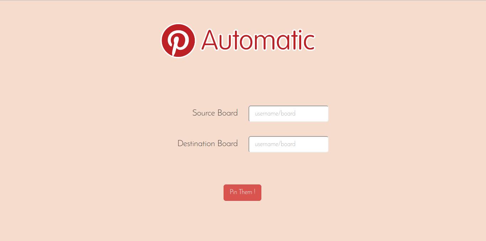
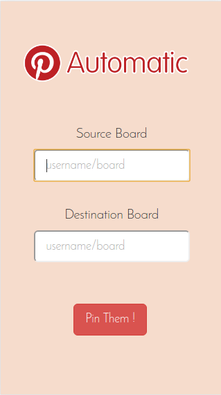

# Pinterest Automatic
#### A webapp to Pin all images of one Pinterest Board to another
Pinning all the pins from someone's board to yours is so tiring. So, I made a webapp to do this boring work !

# Working
* The app first asks you to login to your Pinterest Account using the [OAuth 2.0](href="http://oauth.net/documentation/") process, so as to get rights to pin to your boards.
* As the app uses Pinterest's OAuth 2.0 process, none of your crendentials are stored in the app.
* Once you're logged in, you don't need to login again unless there has been an inactivity for more than 7 days or you clear out your cookies. The app stores your Pinterest Token in cookies, so enable cookies to avoid logging in everytime you use this app.
* Next, you enter the Source Board (from which you want the pins to be taken) and the Destination Board (where you want the pins to be pinned). Source Board and Destination Boards can be entered in 2 ways-
  * Either the complete URL of boards can be entered from the Pinterest Site.
  * or you can enter it manually as "Username/Board-name", if you know the username and board name of the person.
* The app then calls an API which in turn will then call Pinterest API to fetch pins from source board and pin them to destination board.

> The app doesn't store any of your credentials or even your token. The token is stored locally in cookies.
> The Destination Board can even be a Secret Board in your account.

# Usage
The Pinterest OAuth process only redirects to "https" sites. So, as of now the app can be run only on *localhost*.

To run the app make a folder **PinterestAutomatic** in your *htdocs* directory and clone this repository in that folder and run *https://localhost/PinterestAutomatic* in your browser. The browser prompts that the *https* certificate of the site is invalid, but you can go to *Advanced options* and *Continue anyway* as you know that it's your local server.

# Limitations
The only limitation is that you can only pin 1000 pins per hour as this is the limit put up by Pinterest API, but I think that a 1000 pins must be enough for one day :wink: .

# Screenshots

--------------------------
This app complies completely with [Pinterest Developer's Policy](https://developers.pinterest.com/policy/). If you have any issues contact via [email](http://scr.im/3hmx).